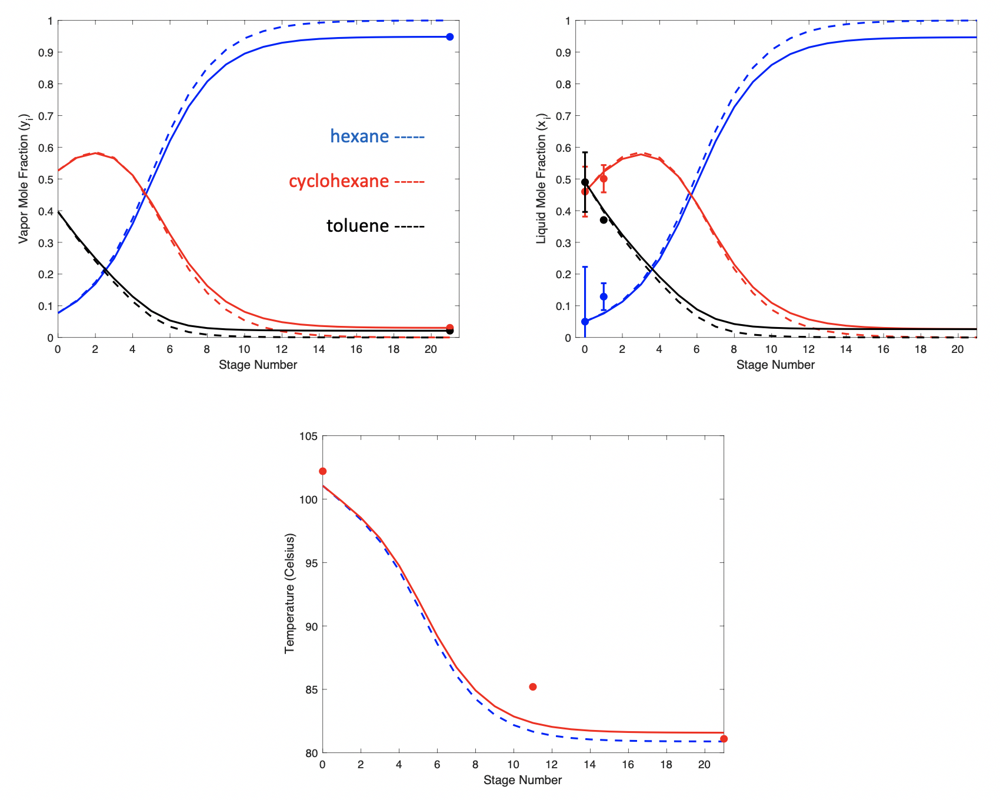
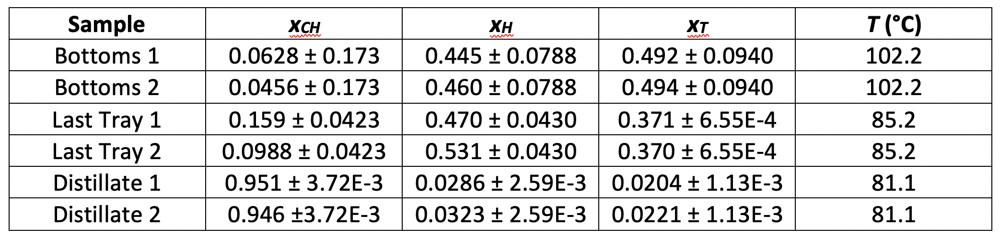
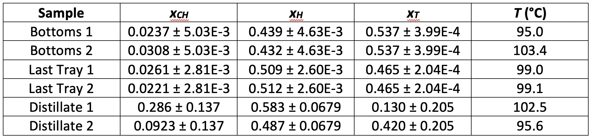

# Distillation of a Ternary Mixture 
_Authors: Robert Davison, Aaron Veronese, Jaehun Chung_

---
---

## Executive Summary

Separation processes play a fundamental role in almost all industries; from alcoholic beverages to cryogenic air separation. Continuous distillation is one method of separation that manipulates operating conditions to produce a steady flow of desired product streams. Distillation is favorable for medium to large-scale applications, such as oil refining, which relies heavily on a consistent flow of products at specified purities. 

The objective of this lab was to conduct and model a continuous distillation of a ternary mixture of cyclohexane, n-heptane and toluene. Experimental data and vapor-liquid equilibrium (VLE) equations were used to model the temperature and composition profiles of the column. The experiment was conducted at both total and finite reflux ratios using a 22-tray, constant pressure distillation column. Starting with a saturated liquid feed of 10/45/45 mole percent cyclohexane/hexane/toluene and constant power supply, the column was allowed to reach steady state. Samples were taken from the distillate, bottoms and last tray. Liquid composition was measured using a refractometer while vapor composition was determined using a gas chromatograph. MATLAB was used to iterate through each individual stage mole balance and calculations were simplified using the constant molal overflow assumption (App. A). We expected to observe a higher percent of hexane in the distillate as it is the most volatile component and target of the separation.

## Results and Discussion

The compositions and temperatures from the experiment are shown in Table 1 and Table 2. For the total reflux trial, we determined that the Murphree efficiency of the column is 0.95. For continuous distillation, the Murphree efficiency is 0.38. Efficiencies were calculated as the average of each component for each stage. These experimental efficiencies are compared to an efficiency of one in the composition and temperature profiles. The sample data points line up closely with the calculated efficiency curves. Moreover, we observed higher temperatures at lower stages. This is because lower stages contain heavier components with higher boiling points. 

Column efficiency was notably high under total reflux conditions compared to the efficiency for the condition of continuous distillation. This is likely because at total reflux, more accurate data was obtained as the system remained at steady-state until samples were taken. In this case, steady state was assumed to be the point when temperature remained constant. However, at finite reflux, the flow rates needed to be constantly adjusted to satisfy the mole balance around the constant feed rate. It was difficult to control the bottoms flow rate due to the pressure difference in the reboiler and the exit valve. Changing the bottoms flow rate would also change the distillate flow rate and made it difficult to maintain the mole balance. This affected the accuracy of our sample compositions and thus resulted in a lower efficiency. 

There were multiple sources of error in this experiment. The greatest source of error came from the poor control we had over bottoms flow rate. Also, column hold up in the distillate condenser gave us smaller values for distillate flow rate. 

This experiment was adequate at characterizing continuous ternary distillation processes. We recommend implementing an automated volumetric flow control system to more accurately measure bottoms flowrate while holding it constant. With a better control system, there is potential for this apparatus to effectively model large industrial processes on a smaller scale.

**Figure 1.** Sample vapor composition curve, liquid composition curve, and column temperature profile for total reflux distillation. The solid lines represent the compositions and temperatures where the Murphree efficiency was accounted for. Stage 0 corresponds to the bottoms and stage 22 corresponds to the distillate. Temperature is highest in the bottoms because it contains a majority of the heavier component toluene with a higher boiling point.

---

### Appendix A. Data

**Table 1.** Sample liquid mole fractions and temperatures at total reflux conditions.

**Table 2.** Sample liquid mole fractions and temperatures at continuous distillation conditions.

**Table 3.** Relevant Physical Properties. 

|component   | Molecular Weight (g/mol)  | Boiling Point (C)  |
|---|---|---|
|hexane   | 86  | 68   |
| cyclohexane  | 84  | 81  |
| toluene  |  92 | 111  |